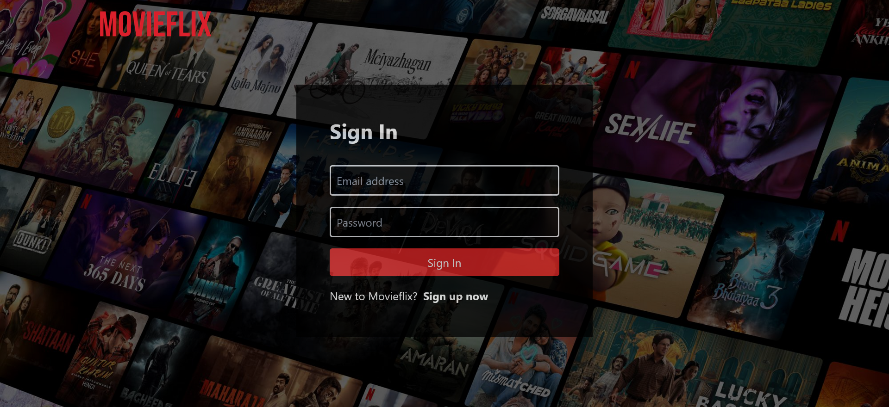
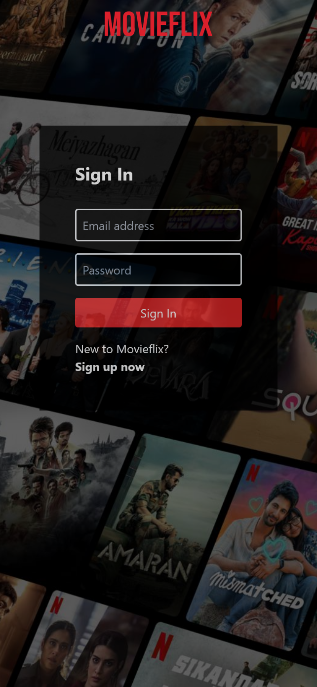
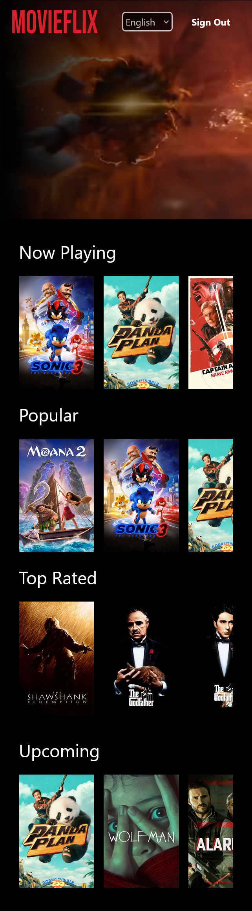

# Movieflix

Movieflix is a responsive movie recommendation web application built using React. It leverages the TMDB API to fetch movie data, incorporates Firebase for authentication, utilizes Redux for state management, and employs Tailwind CSS for styling. The application also offers multi-language support to cater to a diverse user base.

## Features

- 🪪 **Authentication**: Implements user authentication via Firebase.
- 📱 **Responsive Design**: Ensures optimal viewing across various devices.
- 📖 **Multi-Language Support**: Offers content in multiple languages for a global audience.
- ✨ **Styling**: Applies modern and consistent UI designs using Tailwind CSS.
- 🫙 **State Management**: Manages application state efficiently with Redux.

---

## Live Demo

Check out the live app: [Movieflix](https://movieflix-project.netlify.app)

---

## Technologies Used

- **React:** A JavaScript library for building user interfaces, enabling the creation of reusable UI components.

- **Vite:** A fast build tool and development server that offers rapid build times and hot module replacement for an efficient development experience.

- **Tailwind CSS:** A utility-first CSS framework that facilitates the creation of custom designs without leaving your HTML, ensuring a consistent and responsive design.

- **Firebase Authentication:** A backend service that offers easy-to-use authentication, allowing users to sign up and log in securely.

- **Redux:** A predictable state container for JavaScript applications, used for managing and centralizing application state.

- **React Router**: A collection of navigational components that enable declarative routing in React applications.

- **i18next**: An internationalization framework for JavaScript, providing the tools to add multi-language support to the application.

---

## Installation

1. **Clone the Repository**:
   ```bash
   https://github.com/clinton15/movieflix.git
   ```
2. **Navigate to the Project Directory:**
   ```bash
   cd movieflix
   ```
3. **Install the dependencies**:
   ```bash
   npm install
   ```
4. **Set Up Environment Variables:**
   - Create a .env file in the root directory.
   - Add the following variables:
   ```bash
   VITE_TMDB_API_KEY=your_tmdb_api_key
   VITE_FIREBASE_API_KEY=your_firebase_api_key
   VITE_FIREBASE_AUTH_DOMAIN=your_firebase_auth_domain
   VITE_FIREBASE_PROJECT_ID=your_firebase_project_id
   VITE_FIREBASE_STORAGE_BUCKET=your_firebase_storage_bucket
   VITE_FIREBASE_MESSAGING_SENDER_ID=your_firebase_messaging_sender_id
   VITE_FIREBASE_APP_ID=your_firebase_app_id
   ```
5. **Start the Development Server:**
   ```bash
   npm run dev
   ```

---

### Screenshots

#### Desktop View:




#### Mobile View:




---

### Learnings

- **API Integration:** Effectively fetching and handling data from external APIs, specifically the TMDb API.
- **Authentication**: Implementing secure user authentication using Firebase.
- **State Management**: Utilizing Redux to manage application state.
- **Responsive Design**: Designing a user interface that adapts seamlessly to various screen sizes using Tailwind CSS.
- **Multi-Language Support:** Incorporating internationalization to cater to a global audience.

---

### Continued development

- **Recommendations:** Implement personalized movie recommendations based on user preferences.
- **Offline Support:** Allow users to access content even when they are offline or in areas with limited connectivity.

---

### Useful resources

- [Vite](https://vite.dev/) - This contains all the information that you need to know about vite. Personally, it helped me understand how to fetch and use values from the env files.
- [Tailwind CSS](https://tailwindcss.com/docs) - This was my guide for any blockers/issues that i faced while implementing the css classes.
- [React Router](https://reactrouter.com/) - The go-to guide for anything related to react routing.
- [Redux](https://redux.js.org/) - This covers all the information needed to get started with redux. I'd recommend it to anyone still learning redux.
- [Firebase](https://firebase.google.com/docs/auth/web/start) - This is the official guide that provides all the information needed to configure firebase in our apps.

---

## Author

- [Clinton Pereira](https://clinton-pereira-portfolio.vercel.app/)
